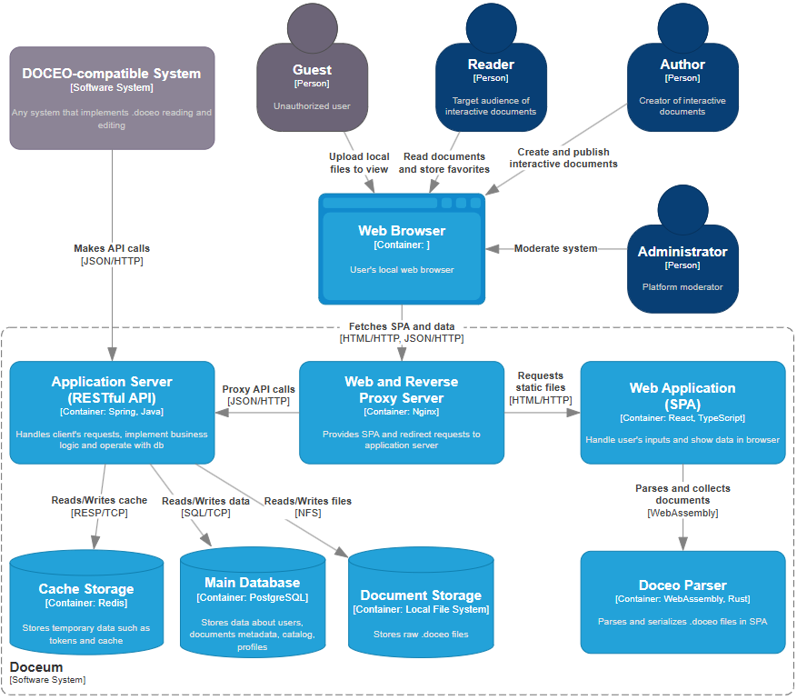
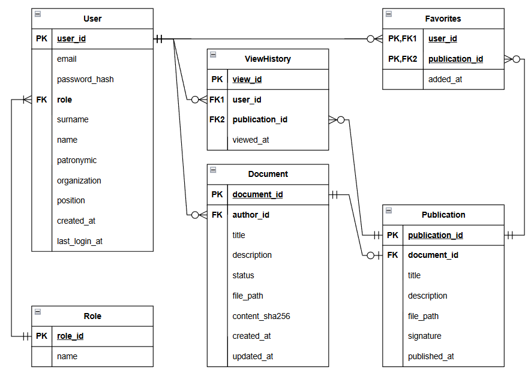

# Doceum

**Веб-платформа для интерактивных документов с криптографической верификацией**

[](https://spring.io)
[](https://openjdk.org)
[](https://react.dev)
[](https://www.typescriptlang.org)
[](https://webassembly.org/)
[](https://www.rust-lang.org)
[](https://www.postgresql.org)
[](https://redis.io)
[](https://www.docker.com)
[](https://github.com/features/actions)
[](LICENSE)

---

## О проекте

**Doceum** (от лат. *doceo* – учу, преподаю) — это платформа для создания, публикации и распространения **интерактивных документов** как самостоятельных цифровых артефактов.

В отличие от обычных текстовых редакторов или баз знаний, Doceum рассматривает документ как **управляемую форму передачи знания** — с вкладками, пошаговыми инструкциями, сворачиваемыми блоками, тестами для самопроверки и другими интерактивными элементами. При этом документы остаются **самодостаточными**, **независимыми от платформы** и **криптографически верифицируемыми**.

Проект решает давнюю проблему оформления знаний: существующие решения заставляют выбирать между интерактивностью (привязка к платформе) и портативностью (потеря богатого пользовательского опыта). Doceum предлагает и то, и другое.

### Основные возможности

- **Интерактивный формат `.doceo`** – ZIP-архив с JSON-деревом блоков (заголовки, параграфы, вкладки, степперы, тесты, блоки кода, изображения и другое)
- **Форматированный текст** – жирный, курсив, подчёркнутый, зачёркнутый, ссылки, моноширинный код, спойлеры, копируемые сниппеты
- **Полный жизненный цикл документа** – черновик - публикация - снятие с публикации - архив
- **Криптографическая верификация** – подпись HMAC‑SHA256 гарантирует целостность и авторство
- **Публичный каталог (Библиотека)** – поиск по названию или автору с пагинацией
- **Избранное** – персональная библиотека сохранённых публикаций
- **Визуальный редактор** – палитра блоков, панель свойств, редактирование в реальном времени
- **Ридер** – отображает любой валидный документ `.doceo` с полной интерактивностью
- **Парсер на WebAssembly** – высокопроизводительная обработка документов, написанная на Rust
- **Самодостаточные документы** – работают офлайн без внешних зависимостей

---

## Технологический стек

| Слой | Технологии |
|------|------------|
| **Бэкенд** | Spring Boot 3, Java 21, Spring Security, JWT, JPA (Hibernate) |
| **Фронтенд** | React 19, TypeScript, MobX, React Router, TipTap, CSS Modules |
| **Парсер** | Rust + WebAssembly (работа с ZIP, валидация JSON, проверка подписи) |
| **Базы данных** | PostgreSQL (основная), Redis (токены) |
| **Файловое хранилище** | Настраиваемый путь в файловой системе |
| **Контейнеризация** | Docker, Docker Compose |
| **Обратный прокси** | Nginx (раздача фронтенда + проксирование API) |
| **CI/CD** | GitHub Actions (тесты - сборка - деплой - уведомление в Telegram) |
| **Деплой** | ВМ Cloud.ru, домен [doceum.ru](https://doceum.ru) |

---

## Сборка и запуск

### Требования

- Docker & Docker Compose (для контейнерного запуска)
- Или локально: JDK 21 + Node.js 20 + Rust (для разработки)

### 1. Запуск через Docker (рекомендуемый)

```bash
git clone https://github.com/Honsage/Doceum.git
cd Doceum

cp .env.example .env
# отредактируйте .env (пароли, секреты, домены)

docker-compose --env-file .env up -d --build
```

После запуска:

- Фронтенд: http://localhost
- Backend API: http://localhost:8080/api

### 2. Локальная разработка

#### Бэкенд

```bash
cd backend

# PostgreSQL и Redis через Docker (опционально)
docker run --name doceum-db -e POSTGRES_DB=doceum -e POSTGRES_USER=postgres -e POSTGRES_PASSWORD=postgres -p 5432:5432 -d postgres:16-alpine
docker run --name doceum-redis -p 6379:6379 -d redis:7-alpine

# Запуск Spring Boot
./mvnw spring-boot:run
```

#### Фронтенд

```bash
cd frontend

npm install
npm run dev
```

Фронтенд будет доступен по адресу http://localhost:3000, API проксируется на бэкенд.

---

## Структура проекта

```
Doceum/
├── .env.example
├── docker-compose.yml
├── LICENSE
├── README.md
├── backend/
│   ├── Dockerfile
│   ├── pom.xml
│   └── src/
│       ├── main/java/ru/doceum/
│       │   ├── common/ports/        # интерфейсы для межмодульного взаимодействия
│       │   └── modules/
│       │       ├── auth/            # аутентификация и пользователи
│       │       ├── documents/       # черновики, публикации, подпись
│       │       ├── hub/             # каталог и поиск
│       │       └── profile/         # избранное и личные документы
│       └── test/
├── frontend/
│   ├── Dockerfile
│   ├── nginx/nginx.conf
│   ├── package.json
│   ├── src/
│   │   ├── components/              # UI-блоки и рендереры .doceo
│   │   ├── pages/                   # страницы (ридер, редактор, каталог, профиль, авторизация)
│   │   ├── stores/                  # MobX-хранилища
│   │   ├── services/                # API-клиенты, парсер, localStorage
│   │   └── types/                   # TypeScript-интерфейсы
│   └── tests/
├── wasm/
│   ├── Cargo.toml
│   └── src/                         # парсер на Rust (WebAssembly)
└── docs/
    └── doceo-format/
        └── ru.SPECIFICATION.md      # формальная спецификация формата .doceo
```

---

## Архитектура

Бэкенд построен как **модульный монолит** с чистой архитектурой внутри каждого модуля:

```
modules/
├── auth/          # аутентификация, JWT, refresh-токены (Redis)
├── documents/     # черновики, публикации, подпись, файловое хранилище
├── hub/           # публичный каталог, поиск
└── profile/       # избранное, документы пользователя
```

Внутри каждого модуля выделены слои:

- **api** – REST-контроллеры
- **application** – use cases и DTO
- **domain** – модели и интерфейсы репозиториев (чистый слой)
- **infrastructure** – JPA, Redis, файловое хранилище, безопасность

Фронтенд — одностраничное приложение (SPA) с:

- **Хранилищами** – MobX (AuthStore, EditorStore, DocumentStore, UiStore)
- **Компонентами** – переиспользуемые UI-блоки + рендереры блоков `.doceo`
- **Страницами** – ридер, редактор, каталог, профиль, авторизация
- **Сервисным слоем** – API-клиент, фасад парсера, localStorage

**WASM-парсер** написан на Rust и компилируется в WebAssembly. Он отвечает за распаковку ZIP, валидацию JSON и построение дерева блоков, вынося тяжёлые операции из основного потока браузера.

### Диаграмма контейнеров (C4)



### ER-диаграмма



---

## API

| Модуль | Метод | Эндпоинт | Описание |
|--------|-------|----------|----------|
| **Auth** | POST | `/api/auth/register` | Регистрация пользователя |
| | POST | `/api/auth/login` | Вход, выдача JWT |
| | POST | `/api/auth/refresh` | Обновление access-токена |
| | POST | `/api/auth/logout` | Отзыв refresh-токена |
| **Documents** | POST | `/api/documents` | Создать черновик |
| | PUT | `/api/documents/{id}/draft` | Загрузить файл `.doceo` |
| | GET | `/api/documents/{id}/draft` | Скачать черновик |
| | DELETE | `/api/documents/{id}/draft` | Удалить документ |
| | POST | `/api/documents/{id}/publish` | Опубликовать (подписать) |
| | DELETE | `/api/documents/{id}/publish` | Снять с публикации |
| | GET | `/api/documents/{id}/view` | Просмотр опубликованного файла |
| | GET | `/api/documents/{id}/metadata` | Получить метаданные |
| | POST | `/api/documents/verify` | Проверить подпись |
| **Hub** | GET | `/api/hub/recent` | Список последних публикаций |
| | GET | `/api/hub/documents` | Поиск по названию или автору |
| | GET | `/api/hub/documents/{id}` | Карточка документа |
| **Profile** | GET | `/api/profile/favorites` | Список избранного |
| | POST/DELETE | `/api/profile/favorites/{id}` | Добавить/удалить из избранного |
| | GET | `/api/profile/documents/drafts` | Мои черновики (AUTHOR) |
| | GET | `/api/profile/documents/published` | Мои публикации (AUTHOR) |

**Аутентификация**: все эндпоинты, кроме `/api/auth/*`, `/api/documents/*/view` и `/api/documents/verify`, требуют валидный JWT-токен в заголовке `Authorization: Bearer <token>`.

**Роли**:

- **READER** – просмотр публикаций, поиск в каталоге, избранное
- **AUTHOR** – создание, редактирование, публикация и удаление своих документов
- **ADMIN** – полный доступ, управление пользователями и публикациями

---

## Дизайн интерфейса

Дизайн разработан в **Figma** с акцентом на читаемость и минимальную когнитивную нагрузку. Цветовая палитра «Soft Clarity» использует тёплые нейтральные тона с мягким мятным акцентом.

**Принципы дизайна:**

- **Спокойствие и читаемость** – мягкие нейтральные тона снижают усталость глаз при длительной работе
- **Функциональная выразительность** – акцентный цвет объединяет свойства бежевого и зелёного, что важно для образовательных материалов
- **Фирменный стиль** – собственный логотип (стилизованная буква «D» с элементами свитка)

### Цветовая палитра

| Роль | Светлая тема | Тёмная тема |
|------|-------------|-------------|
| Основной фон | `#FAF9F6` | `#1a1a1a` |
| Вторичный фон | `#F0EDE8` | `#2a2a2a` |
| Основной текст | `#2C2A27` | `#e0e0e0` |
| Акцент | `#5E9A8C` | `#7EB09E` |
| Выноска (информация) | `#ECF2F6` / `#A3B8C9` | `#1e2a3a` / `#4a6a8a` |
| Выноска (совет) | `#E6F0ED` / `#5E9A8C` | `#1a2a22` / `#4a8a6a` |
| Выноска (внимание) | `#FAF4E8` / `#E8B66C` | `#2a241a` / `#b89a4a` |
| Выноска (опасность) | `#FAECEB` / `#FA8F89` | `#2a1a1a` / `#c06a6a` |

**Типографика:**

- **Основной шрифт:** Lora (serif) – тёплый, «книжный», с хорошей поддержкой кириллицы
- **Моноширинный:** JetBrains Mono – для блоков кода и inline-кода

**Макет в Figma:** [https://www.figma.com/design/syDWeHawJRQ0vODRcVIC62/Doceum](https://www.figma.com/design/syDWeHawJRQ0vODRcVIC62/Doceum?node-id=0-1&p=f&t=Jv7lH1h0MbIGVVvx-0)

---

## Тестирование

### Бэкенд

```bash
cd backend
mvn test
```

### Фронтенд

```bash
cd frontend
npm run test           # все тесты
npm run test:unit      # только модульные
npm run test:fuzz      # property‑based фаззинг
```

### WASM-парсер

```bash
cd wasm
cargo test
```

---

## Развёртывание

### Переменные окружения

Создайте файл `.env`:

```env
# База данных
DB_NAME=doceum
DB_USER=postgres
DB_PASSWORD=ваш_надёжный_пароль
DB_HOST=postgres
DB_PORT=5432

# Redis
REDIS_HOST=redis
REDIS_PORT=6379

# JWT
JWT_SECRET=ваш_jwt_секрет_не_менее_32_символов

# CORS
CORS_ALLOWED_ORIGINS=https://doceum.ru,https://www.doceum.ru

# Подпись документов
DOCEO_SIGNING_SECRET=ваш_секрет_подписи

# Хранилище файлов
STORAGE_ROOT=/storage

# URL API для фронтенда (относительный путь)
VITE_API_URL=/api
```

### Продакшен

```bash
docker-compose --env-file .env up -d --build
```

Платформа доступна по адресу **https://doceum.ru**

### CI/CD (GitHub Actions)

Конвейер запускается при каждом пуше в ветку `master` и включает следующие задачи:

1. **test-backend** – запуск JUnit-тестов через Maven
2. **test-frontend** – запуск модульных тестов фронтенда
3. **build** – сборка JAR и фронтенда
4. **deploy** – деплой на production-сервер
5. **telegram_notify** – отправка уведомления о статусе деплоя в Telegram

---

## Документация

- [**Спецификация формата `.doceo`**](./doceo-format/ru.SPECIFICATION.md)
- Спецификация описывает структуру ZIP-архива, схему манифеста, типы узлов, правила валидации (16 инвариантов) и политику версионирования

---

## Лицензия

Проект распространяется под лицензией **MIT** – вы можете свободно использовать, изменять и распространять код.

Приветствуется любое содействие! Открывайте issues и pull request.

---

## Ссылки

- **Демо**: [https://doceum.ru](https://doceum.ru)
- **Спецификация формата**: [https://honsage.github.io/Doceum/](https://honsage.github.io/Doceum/)
- **Макет в Figma**: [https://www.figma.com/design/syDWeHawJRQ0vODRcVIC62/Doceum](https://www.figma.com/design/syDWeHawJRQ0vODRcVIC62/Doceum?node-id=0-1&p=f&t=Jv7lH1h0MbIGVVvx-0)